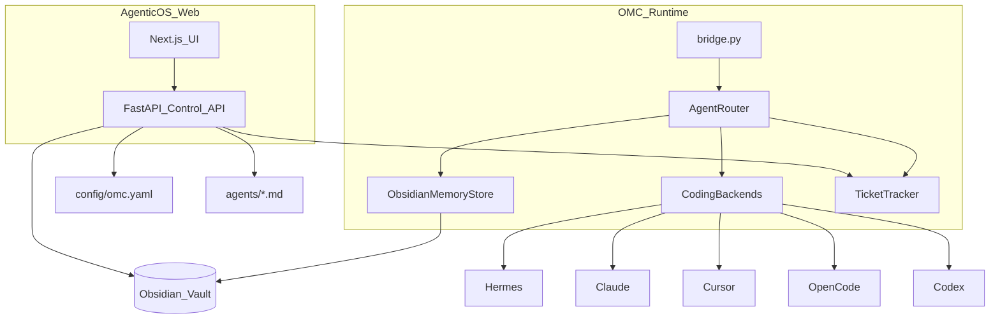

# Codex + Obsidian Memory + Agentic OS

## Problem

Today each coding backend (`hermes`, `claude`, `cursor`, `opencode`) keeps its own session/memory. Switching `@Coder` backends loses context. Config lives only in YAML/env with no UI. You need:

1. **Codex** as another coding CLI backend
2. **Obsidian vault** as the single shared memory so any coding agent can resume the same TASK/context
3. **Agentic OS** — a web control plane to configure the whole OMC company (channels, tickets, agents, tools, kanban)

## Architecture (target)



**Default stack (locked):** FastAPI (same Python repo as bridge) + Next.js App Router UI under [`apps/agentic-os/`](apps/agentic-os/). Config source of truth remains files on disk (`config/omc.yaml`, `agents/`, Obsidian vault); the UI reads/writes those files via API — no second database required for MVP.

---

## Part A — Codex coding backend

Extend [`core/coding/`](core/coding/) the same way as Claude/OpenCode:

- Add [`core/coding/codex.py`](core/coding/codex.py) — invoke OpenAI Codex CLI (default command `["codex", "exec"]` or config override; cwd = `coding.workspace`)
- Register in [`core/coding/factory.py`](core/coding/factory.py): `CODING_MENTIONS` += `codex`; `_build_backend("codex", …)`
- Update [`config/omc.yaml`](config/omc.yaml): `backends.codex`, `aliases.codex: codex`; add `codex` to `engineering` / `support` topic agents and `agent_routes` / `status_authority` like other coding aliases
- Persona reuse: `ROLE_FILES["codex"] = "coder.md"` in [`core/config.py`](core/config.py)
- README: `@Codex` mention + CLI install note

---

## Part B — Obsidian as shared cross-agent memory

### Design

Obsidian is a **folder of markdown**. Every agent turn reads/writes structured notes so switching Hermes → Codex → Cursor keeps the same TASK memory.

Vault layout (created/ensured at startup):

```text
{obsidian.vault_path}/
  OMC/
    _index.md                 # dashboard links
    tasks/
      TASK-014.md             # canonical task memory
    agents/
      pm.md / sa.md / …       # optional per-role scratch (session notes)
    decisions/
      ADR-….md                # SA design decisions
    daily/
      2026-07-24.md           # standup digests
    handoffs/
      TASK-014-latest.md      # last handoff packet
```

### Task note schema (frontmatter + body)

```markdown
---
task_id: TASK-014
status: in_progress
topic: engineering
assignee: coder
backend: codex
ticket_url: https://…
updated: 2026-07-24T10:00:00Z
---
# TASK-014: Login for SaaS

## Goal
…

## Spec
…

## Acceptance criteria
…

## Implementation notes
(appended by whichever coding backend last ran)

## Handoff log
- 10:01 PM → SA
- 10:12 SA → Coder (@Codex)
```

### Runtime module

- [`core/memory/obsidian.py`](core/memory/obsidian.py) — `ObsidianMemoryStore`
  - `ensure_vault()`
  - `get_task(task_id)` / `upsert_task(...)`
  - `append_handoff(task_id, from_role, to_role, message)`
  - `append_agent_note(task_id, role, backend, text)`
  - `build_context_prompt(task_id) -> str` (injected into every agent/coding call)
- Wire in [`core/agent_router.py`](core/agent_router.py):
  1. After ticket resolve, load Obsidian context into `[MEMORY]`
  2. After each agent reply, upsert status + append note/handoff
- Config block:

```yaml
memory:
  provider: obsidian   # none | obsidian
  obsidian:
    vault_path: "${OMC_OBSIDIAN_VAULT}"
    root_folder: OMC
```

**Why this enables cross-backend switching:** `@Coder` / `@Codex` / `@Claude` all receive the same `[MEMORY]` block from `TASK-NNN.md` and all write back to it. Discord chat is the conversation surface; Obsidian is the durable brain.

---

## Part C — Agentic OS web application (feature catalog)

Control plane for the One Man Company. Users configure everything that today is YAML/env, plus operate Kanban and inspect memory.

### C1. Platform & connections

| Feature | Description |
|---------|-------------|
| Chat adapters | Discord / Zulip / Slack: bot tokens, guild/workspace, enable/disable |
| Topic channels | Map `#product` `#engineering` `#marketing` `#support` `#standup` → channel IDs; CRUD topics |
| Ticket providers | Plane / Jira / none: base URL, workspace/project, API keys, status_map editor |
| Coding backends | Hermes, Claude, Cursor, OpenCode, **Codex**: command array, enable flag, default backend, `OMC_WORKSPACE` |
| Memory | Obsidian vault path, root folder, open-in-Obsidian deep link, vault health check |
| Secrets vault | Store API keys/tokens (encrypted at rest or OS keyring); never commit to git; sync to `.env` / process env for bridge |
| Bridge control | Start/stop/restart bridge process; live logs; health |

### C2. Agent studio (roles & rules)

| Feature | Description |
|---------|-------------|
| Role library | CRUD roles: PM, SA, Coder, QA, DevOps, Marketing, Standup, custom |
| Persona editor | Edit `agents/{role}.md` in-browser (markdown + preview) |
| Shared rules | Edit `agents/_shared/sdlc.md` and `handoff.md` |
| Mention aliases | Map `@Codex` → backend `codex`; `@Coder` → default |
| Route graph | Visual who-may-`@mention`-whom (`agent_routes`) |
| Status authority | Per-role allowed Kanban/status keywords |
| Topic membership | Which roles are allowed in each topic |
| Ticket create rights | Which roles may create TASK/issues per topic |
| Import/export | Pack/unpack agent packs as zip/markdown |

### C3. Tools & tool configuration

| Feature | Description |
|---------|-------------|
| Tool registry | Catalog: ticket.create, ticket.transition, memory.read/write, coding.run, chat.send, httpwebhook, shell (gated) |
| Per-role tool allowlist | e.g. Marketing cannot run `coding.run` |
| Tool config forms | Jira fields, Plane states, coding CLI flags, webhook URLs |
| MCP / external tools | Register MCP servers later (phase 2); MVP stubs + docs |
| Sandbox policy | Workspace roots coding agents may touch; deny paths |

### C4. Workflow / OMC builder

| Feature | Description |
|---------|-------------|
| Topic workflow templates | SaaS default (product→engineering→…); clone/customize |
| Stage machine editor | Visual SDLC stages + keyword mapping (aligned with `SdlcStatus`) |
| Handoff playbooks | Preset chains (Feature, Bug, Hotfix) shown to agents / injected as tips |
| Simulation mode | Dry-run a Boss message through PM→SA→Coder without calling real CLIs |
| Depth / loop limits | Configure `forward_max_depth`, rate limits |

### C5. Kanban & operations

| Feature | Description |
|---------|-------------|
| Kanban board | Columns = SDLC statuses; cards = TASK-NNN from TaskManager + ticket provider |
| Card detail | Goal, Obsidian note, Discord deep link, ticket URL, assignee role, last backend |
| Drag-drop status | Updates Plane/Jira via TicketTracker + Obsidian frontmatter |
| Filters | Topic, assignee, backend, date |
| Activity timeline | Handoff log from Obsidian |
| Standup view | Generate/edit daily note; post summary hint for `#standup` |

### C6. Memory browser (Obsidian)

| Feature | Description |
|---------|-------------|
| Vault browser | Tree of `OMC/tasks`, `decisions`, `daily` |
| Task note editor | Edit markdown + frontmatter |
| Search | Full-text across vault |
| Sync status | Last write by which agent/backend |

### C7. Observability & admin

| Feature | Description |
|---------|-------------|
| Live message inspector | Recent Discord/Zulip events and which agent fired |
| Cost/latency (phase 2) | Per-backend run duration |
| Audit log | Config changes, secret updates, board moves |
| Multi-company (phase 2) | Multiple OMC profiles/workspaces |

---

## Delivery phases

### Phase 1 (this implementation pass)

1. **Codex** backend + config/alias wiring  
2. **ObsidianMemoryStore** + router inject/persist  
3. **Agentic OS scaffold**
   - [`apps/api/`](apps/api/) FastAPI: read/write `omc.yaml`, agents markdown, secrets env file, vault health, tickets list, bridge status stub  
   - [`apps/agentic-os/`](apps/agentic-os/) Next.js: pages for Connections, Topics, Agents, Coding/Memory, Kanban (read-only cards from task_map + Obsidian)  
4. Docs in README: `@Codex`, Obsidian vault setup, how to run Agentic OS (`uvicorn` + `next dev`)

### Phase 2 (follow-up)

- Full Kanban drag-drop → ticket transitions  
- Visual route-graph editor  
- Bridge process manager + live logs  
- Simulation mode  
- MCP tool registry  

### Phase 3 (later)

- Multi-workspace / multi-tenant  
- Cost analytics  
- Native Obsidian plugin (optional; vault files remain primary)

---

## Key files to add/change (Phase 1)

| Path | Change |
|------|--------|
| [`core/coding/codex.py`](core/coding/codex.py) | New backend |
| [`core/coding/factory.py`](core/coding/factory.py) | Register codex |
| [`core/memory/obsidian.py`](core/memory/obsidian.py) | Shared memory store |
| [`core/agent_router.py`](core/agent_router.py) | Inject + persist memory |
| [`core/config.py`](core/config.py) | `memory` + codex role file |
| [`config/omc.yaml`](config/omc.yaml) | coding.codex + memory.obsidian |
| [`apps/api/main.py`](apps/api/main.py) | FastAPI control plane |
| [`apps/agentic-os/`](apps/agentic-os/) | Next.js UI MVP |
| [`README.md`](README.md) | Setup for Codex, Obsidian, Agentic OS |

## Out of scope (Phase 1)

- Building a custom Obsidian Electron app  
- Replacing Discord as the chat UX  
- Full MCP marketplace  
- Editing the attached plan file  
