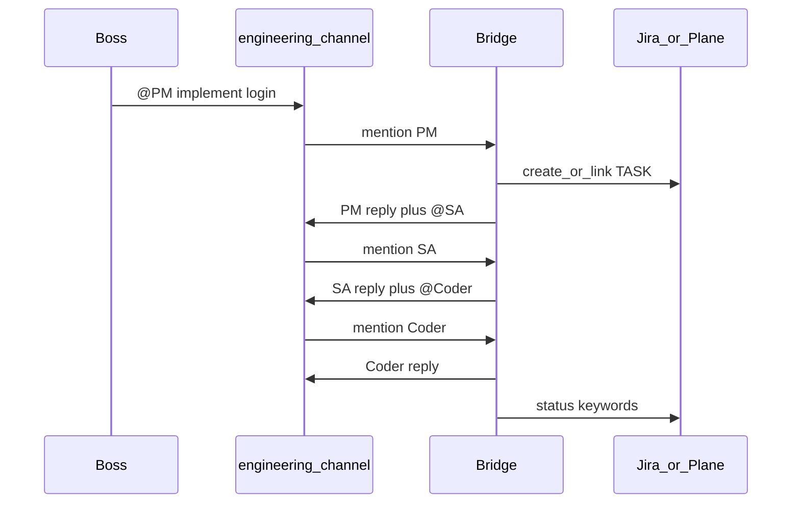
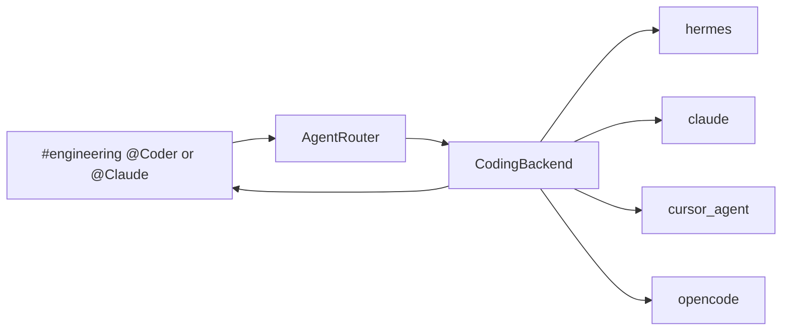

# Topic Channels + In-Channel @Agent Handoffs

## Design (locked)

- **Topic channels**, not role channels. Defaults are SaaS-oriented (below), fully driven by YAML.
- **Trigger:** explicit `@Agent` mention only (human or another agent). No auto-reply without a mention.
- **Handoffs stay in the same channel** — agents post as `**[@PM]**` replies and may `@SA:` / `@Coder:` the next role; the bridge invokes that agent in-place (no cross-channel forward).
- **Tickets** stay on Plane/Jira/`none` via existing [`core/tickets/`](core/tickets/).



## Recommended default topics (SaaS)

Replaces the earlier Omnireach set (`project-idea` / `development` / `marketing` / `summary`) with a layout that matches how real SaaS teams chat:

| Topic key | Discord name (suggested) | Purpose | Agents allowed | Typical Boss use |
|-----------|--------------------------|---------|----------------|------------------|
| `product` | `#product` | Roadmap, ideas, prioritization, PRDs | PM, SA | “Should we build X?” / scope / accept ideas |
| `engineering` | `#engineering` | Spec → code → QA → deploy | PM, SA, Coder, QA, DevOps | “@PM implement login for saas” |
| `marketing` | `#marketing` | Launch, positioning, release notes, growth | PM, Marketing | Post-ship GTM / campaigns |
| `support` | `#support` | Customer issues, bugs, escalations | PM, SA, Coder, QA | “Customer can’t reset password” |
| `standup` | `#standup` | Cross-topic digest / daily status | Standup (digest bot) | “What shipped this week?” |

**Why these five**

- **product** vs “project-idea”: continuous product work, not one-off brainstorming.
- **engineering** vs “development”: includes QA + DevOps release talk in one room (natural for small SaaS).
- **marketing**: unchanged — GTM stays separate so eng noise does not bury launch work.
- **support** (new): SaaS needs a customer-facing loop; bugs start here and hand off `@SA` / `@Coder` without polluting `#product`.
- **standup** vs “summary”: familiar ops ritual; digest-only agent, no eng handoffs.

**Intentionally not separate channels (stay lean)**

- No `#devops` / `#qa` rooms — those roles live inside `#engineering` via `@QA` / `@DevOps`.
- No `#sales` — fold into `#marketing` or `#support` until you need it.
- No `#incidents` — use `#support` + `#engineering` unless on-call volume grows.

## Default topic map (in [`config/omc.yaml`](config/omc.yaml))

```yaml
topics:
  product:
    channel_id: "REPLACE_PRODUCT_CHANNEL_ID"
    agents: [pm, sa]
    ticket_create_roles: [pm, sa]
  engineering:
    channel_id: "REPLACE_ENGINEERING_CHANNEL_ID"
    agents: [pm, sa, coder, qa, devops]
    ticket_create_roles: [pm, sa]
  marketing:
    channel_id: "REPLACE_MARKETING_CHANNEL_ID"
    agents: [pm, marketing]
    ticket_create_roles: [pm]
  support:
    channel_id: "REPLACE_SUPPORT_CHANNEL_ID"
    agents: [pm, sa, coder, qa]
    ticket_create_roles: [pm, sa]
  standup:
    channel_id: "REPLACE_STANDUP_CHANNEL_ID"
    agents: [standup]
    ticket_create_roles: []
```

Agent-to-agent allow-list (role graph, independent of topic):

```yaml
agent_routes:
  pm: [sa, devops, marketing, coder]   # coder allowed mainly for support escalations
  sa: [pm, coder, qa]
  coder: [sa, qa, devops]
  qa: [sa, coder, devops]
  devops: [pm, coder, qa]
  marketing: [pm]
  standup: []
```

A mention is accepted only if: target is in the **topic’s agents** AND (for agent speakers) in the speaker’s `agent_routes`. Humans may `@` any agent allowed in that topic.

## Talking to coding agents (Hermes / Claude Code / Cursor / OpenCode)

Today `@Coder` is only a Hermes persona (`hermes -z`). For real implementation work you need a **pluggable coding backend** — same idea as Plane vs Jira for tickets.

### How you communicate (Discord / Slack / Zulip)

In `#engineering` (or `#support`):

| You type | What runs |
|----------|-----------|
| `@Coder …` | Default coding backend (config) — orchestration reply + implement in workspace |
| `@Hermes …` | Hermes CLI directly (bypass Coder persona if you want raw Hermes) |
| `@Claude …` | Claude Code CLI (`claude -p` / print mode) in configured repo |
| `@Cursor …` | Cursor agent CLI/SDK against configured repo |
| `@OpenCode …` | OpenCode CLI against configured repo |

SA/PM handoffs still use `@Coder` so the company flow stays natural; you use the vendor aliases when you want a **specific** tool.



### Config (chosen approach)

```yaml
coding:
  default: hermes          # used by @Coder
  workspace: "${OMC_WORKSPACE}"   # repo the coding agent may edit
  backends:
    hermes:
      command: ["hermes", "-z"]
      session_prefix: omc-coder
    claude:
      command: ["claude", "-p", "--output-format", "text"]
      # prompt appended as final arg / stdin
    cursor:
      command: ["agent"]   # Cursor CLI; override if your install differs
    opencode:
      command: ["opencode", "run"]
  # Optional mention aliases → backend key (also must appear in topic.agents)
  aliases:
    hermes: hermes
    claude: claude
    cursor: cursor
    opencode: opencode
    coder: null            # null = use coding.default
```

`#engineering` agents list becomes:

`[pm, sa, coder, qa, devops, hermes, claude, cursor, opencode]`

(Aliases that are not installed simply error with a clear “backend not configured / CLI missing” message in-channel.)

### Implementation sketch

- [`core/coding/base.py`](core/coding/base.py) — `CodingBackend.run(prompt, *, workspace, session_key) -> str`
- [`core/coding/hermes.py`](core/coding/hermes.py) — current subprocess path (also used for PM/SA/QA personas)
- [`core/coding/claude.py`](core/coding/claude.py), [`cursor.py`](core/coding/cursor.py), [`opencode.py`](core/coding/opencode.py) — CLI wrappers, cwd=`workspace`
- [`core/coding/factory.py`](core/coding/factory.py) — resolve mention → backend
- Router: non-coding roles (PM/SA/QA/…) always use Hermes + persona markdown; coding mentions use CodingBackend (persona `coder.md` still prepended for `@Coder` so SDLC/ticket language stays consistent)

### Scope for this change set

- Ship the **interface + Hermes backend (full)** + **Claude / Cursor / OpenCode runners** that invoke local CLIs if present.
- Document required CLI install + `OMC_WORKSPACE`.
- Do not build deep IDE UIs or Cursor Cloud Agents in this pass.

## Core routing rewrite ([`core/agent_router.py`](core/agent_router.py))

1. Resolve **topic** from `msg.channel_id`.
2. Parse `@pm`, `@PM`, `@sa`, … (case-insensitive) for agents in that topic.
3. Primary addressee = first mention (or the agent @’d in an agent-to-agent chain).
4. Load that role’s persona from [`agents/{role}.md`](agents/) + shared SDLC/handoff.
5. Hermes session: `omc-{topic}-{role}`.
6. Reply in the **same channel**, prefixed `**[@PM]** …`.
7. Parse further `@role:` lines → same-channel follow-up turns (depth-limited).
8. Tickets: topic `ticket_create_roles` + existing tracker; status authority by **role**.

Remove: cross-channel `**[↪ #pm → #sa]**` forwarding and one-persona-per-channel prompts.

## Supporting updates

- [`core/config.py`](core/config.py) — load `topics`, `agent_routes`, `topic_by_channel_id`, `agent_prompts[role]`.
- [`agents/_shared/handoff.md`](agents/_shared/handoff.md) — in-channel `@SA:` protocol; which topics to use for what; drop Boss-only-in-`#pm`.
- Role personas — same-channel mention examples; topic hints (e.g. support bugs vs product features).
- Add [`agents/standup.md`](agents/standup.md) — digest/recap only (rename of former summary agent).
- [`bridge.py`](bridge.py) — topic registry wiring.
- [`README.md`](README.md) — SaaS topic UX + examples for engineering and support.

## Interaction examples

**Engineering (feature)**

```
You:  @PM Please help me start to implement login for saas
PM:   **[@PM]** Creating TASK-014 … Status: todo
      @SA Please complete analysis/spec for login …
SA:   **[@SA]** Spec ready. Status: in progress
      @Coder Follow the spec and implement …
```

**Support (customer bug)**

```
You:  @PM Customer reports password reset email never arrives
PM:   **[@PM]** TASK-015 … Status: todo
      @SA Triage — SMTP vs app bug?
SA:   **[@SA]** Likely provider config. @Coder add retry + better error logging
```

All chat stays in the topic channel; Plane/Jira tracks status keywords.

## Out of scope

- Discord native role pings / per-agent Discord users (text `@PM` is enough).
- Slack/Telegram features beyond the same mention parser.
- Deleting `legacy/`.
